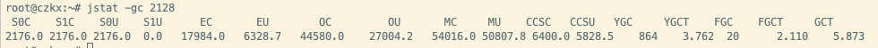

**jps**: 获取 PID 

**jstat -gc PID**:

```
 S0C    S1C    S0U    S1U      EC       EU        OC         OU       MC     MU    CCSC   CCSU   YGC     YGCT    FGC    FGCT     GCT
2176.0 2176.0 2176.0  0.0   17984.0   6328.7   44580.0    27004.2   54016.0 50807.8 6400.0 5828.5    864    3.762  20      2.110    5.873
```



ccsc: 当前压缩类空间大小


S0C:    From Survivor 区大小

S1C:    To Survivor 区的大小

S0U:    From Survivor 区当前使用的内存大小

S1U:	To Survivor 区当前使用的内存大小

EC:       Eden区大小

EU:      Eden 区当前使用的内存大小

OC:     老年代大小

OU:     老年代使用的内存大小

MC:     方法区(元数据区 永久代) 的大小

MU:     方法区(元数据区 永久代) 当前使用的内存大小

YGC:    系统运行至今 Young GC 次数

YGCT:  Young GC 耗时

FGC:    系统运行至今 Full GC 次数

FGCT:  Full GC 耗时

GCT:	所有 GC 耗时


**jstat -gccapacity pid:** 堆内存分析

**jstat -gcnew pid**: 年轻代 GC 分析, 这里的 TT 和 MTT 可以看到对象在年轻代存活的年龄和存活的最大年龄

**jstat -gcnewcapacity pid**: 年轻代内存分析

**jstat -gcold pid**: 老年代 GC 分析

**jstat -gcoldcapacity pid**: 老年代内存分析

**jstat -gcmetacapacity pid**: 元数据内存分析


#### 如何使用 jstat 工具

- 新生代对象增长的速率

- Young GC 触发的频率
- Young GC 的耗时
- 每次 Young GC 后有多少对象是存活下来的
- 每次 Young GC 过后有多少对象进入了老年代
- 老年代对象增长的速率
- Full GC 的触发频率
- Full GC 的耗时


##### 新生代对象增长的速率

**jstat -gc pid 1000 10**: 每隔一秒钟更新出最新的一行 jstat 统计信息, 一共执行 10 次 jstat 统计


