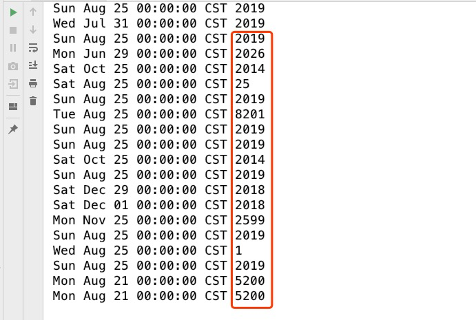

### 2019-08-19   ==>   2019-08-25

1. Algorithm (每周最少做一个 LeetCode 算法题)   
   - [只出现一次的数字](https://leetcode-cn.com/problems/single-number/)
   - [Java 代码](https://github.com/crazykx/backserver-study/tree/master/右耳闻风/ARTS/LeetCode/Algorithm/java/src/SingleNumber)
   
2. Review (阅读并点评至少一篇英文技术文章)
   
   - [Teach Yourself Programming in Ten Years](./Review/001.Teach Yourself Programming in Ten Tears.md)
   
3. Tip 学习至少一个技术技巧
   
   - [SimpleDateFormat]()
   
   - SimpleDateFormat 线程不安全, 如下:
   - 解决:  [ThreadLocal]()  [ Java8线程安全的日期时间 API]()
   
4. Share 分享一篇有观点和思考的技术文章

   - [如何超过大多数人](https://coolshell.cn/articles/19464.html)

